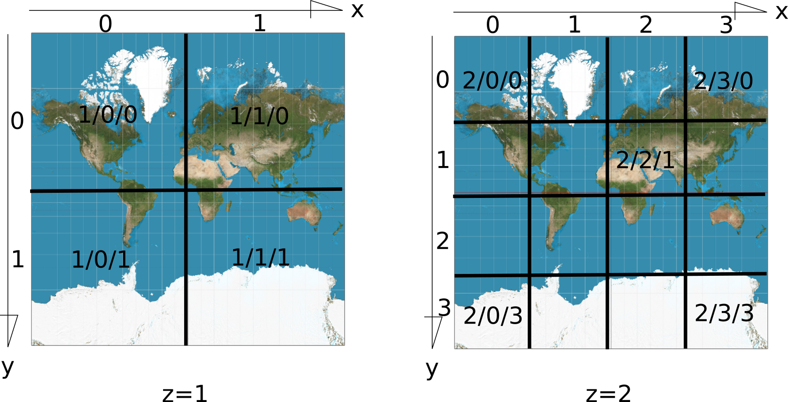

## Introduction

Quand on consulte une page web, notre **client** Firefox, Chrome, Safary ou Internet Explorer, dialogue avec un **serveur**.

Le but de cet atelier est de créer un serveur pour exposer nos donnée PostGIS dans une page web.


## Démarrer

Démarrons la [machine virtuelle du workshop](http://37.187.164.233/workshop_postgis_flask_openlayers.ova), le nom d'utilisateur est `vagrant` et le mot de passe `vagrant`.


## Développer proprement en python

### Python

Python est un langage de programmation interprété. Il permet une initiation aisée aux concepts de base de la programmation.

Les programmes Python sont des fichiers texte que l'on crée avec un éditeur de texte.

Ouvrons l'éditeur via le menu: `Applications -> Accessories -> Text Editor` puis créons notre premier programme:
```python
print("Hello world")
```

Sauvons le programme (`Ctrl+s`) avec comme nom `hello.py`

Ouvrons maintenant une console `Application -> Terminal Emulator` et exectutons le programme:
```sh
python3 hello.py
```

| Astuce: vous pouvez passer de l'editeur à la console en cliquant sur la barre de tâches qui se trouve en haute de l'écran ou avec `Alt+tab`|
| --- |

### virtualenv

virtualenv est un outil pour créer des environnements virtuels Python isolés. virtualenv crée un dossier qui contient tous les exécutables nécessaires pour utiliser les paquets qu’un projet Python pourrait nécessiter.

L'objectif est d'avoir un environnemet contrôlé, en particulier:
- ne pas dépendre implicitement de modules installés sur la machine de développement
- garder le controle sur les version des modules installés

Commençons donc par créer un environnement virtuel puis activons le:

| Attention: la deuxième ligne ne contient pas de typo, on utilise bien l'opérateur . du bash pour sourcer le script activate qui modifie l'environnement |
| --- |

```sh
virtualenv -p python3 venv
. venv/bin/activate
```

## Installer et tester le serveur flask

Flask est un module python permettant de développer très simplement une application web.

Flask inclu, entre autre, un serveur web pour tester l'application en cours de développement, c'est ce que nous utiliserons dans un premier temps.

| Attention: le serveur flask n'a pas vocation a être utilisé en production.|
| --- |


Pour installer le module flask:

```sh
python3 -m pip install flask
```

Pour tester que tout fonctionne, commençons par le traditionnel "Hello world", mais cette fois en mode serveur web:

Dans le programme suivant, nous utilisons flask pour créer une application `app`:

```python
from flask import Flask

app = Flask(__name__)

@app.route('/')
def hello():
    return "Hello World!"

app.run(host='0.0.0.0', port='5000')
```

Une fois le code du programme enregistré sous `hello_server.py`, nous pouvons l'executer:

```sh
python3 hello_server.py
```

Nous devrions maintenant pouvoir accéder à une page web à l'adresse `127.0.0.1:5000` soit dans la machine virtuelle (`Applications -> Web Browser`) soit sur la machine hôte (votre machine) en ouvrant votre navigateur habituel.


## Exposer ses données

Pour nous connecter à la base PostGIS nous utilisons le module `psycopg2`:

```sh
python3 -m pip install psycopg2
```

Posgis3 permet de transformer très simplement le contenu d'une table en geojson:

```sql
select json_build_object(
    'type', 'FeatureCollection',
    'features', json_agg(ST_AsGeoJSON(verre.*)::json)
) as geojson
from verre;
```

Pour exposer nos donnée en geojson, il nous suffit de renvoyer le résulat de la requète précédente. Le programme `serveur.py` va nous servir de base pour la suite:

```python
from flask import Flask
from psycopg2 import connect

app = Flask(__name__)

@app.route('/geojson')
def geojson():
    with connect("service=workshop") as con:
        cur = con.cursor()
        cur.execute("""
            select json_build_object(
                'type', 'FeatureCollection',
                'features', json_agg(ST_AsGeoJSON(verre.*)::json)
            ) as geojson
            from verre
            """)
        return cur.fetchone()[0]

app.run(host='0.0.0.0', port='5000')
```


## Créer une page web carto


### Servir des fichiers avec flask

Flask est capable de servir des fichiers. Le code suivant, par exemple, renvoie le fichier situé dans un sous répertoire `static` de l'application (i.e. un répertoire `static` à côté du fichier `serveur.py` auquel on a ajouté la "route" ci-dessous):

```python
@app.route('/<path:path>')
def send_file(path):
    return app.send_static_file(path)
```

Par exemple le fichier `hello.html` est accessible à l'adresse `127.0.0.1:5000/hello.html`:

```html
<!DOCTYPE html>
<html>
  <body>
    Hello from html
  </body>
</html>
```


### Construire son application

Les applications web sont écrites en javascript qui est, comme Python, un langage de programmation interprété. Comme la bande passante est critique pour ce type d'application, il est d'usage de transformer le texte original du programme à l'aide d'un **bundler** pour créer un **bundle**.

Sans trop entrer dans les détails, les répertoire de l'application `app1` contient trois fichiers:
  - package.json: décrit les dépendances de l'application (ici openlayers) et comment construire le bundle
  - index.html: décrit la structure de la page web (titre, position et taille de la carte)
  - index.js: contient la logique de l'application

Pour créer le bundle, il suffit de lancer:

```sh
npm install
npm run build
```

Cette commande vas créer, comme spécifié dans `package.json`, un fichier `index.html` transformé dans le répertoire `static` et y adjoindre les scripts de l'application transformés eux aussi.

Nous pouvons lancer le serveur et voir une carte à l'adresse `127.0.0.1:5000/index.html`

Le fichier `package.json` ne présente pas d'intérêt particulier pour ce tutoriel.

Le fichier `index.html` est notre page web, notons la taille de la carte en en-tête (`<head>`), un élément carte et le script associé dans le corps du document (`<body>`):

```html
<!DOCTYPE html>
<html>
  <head>
    <meta charset="utf-8">
    <title>Minimalist OpenLayers page</title>
    <style>
      #map {
        width: 400px;
        height: 250px;
      }
    </style>
  </head>
  <body>
    <div id="map"></div>
    <script src="./index.js"></script>
  </body>
</html>
```

Le fichier `index.js` défini la carte et la logique associée:

```js
import 'ol/ol.css';
import {Map, View} from 'ol';
import TileLayer from 'ol/layer/Tile';
import VectorLayer from 'ol/layer/Vector';
import OSM from 'ol/source/OSM';
import VectorSource from 'ol/source/Vector';
import GeoJSON from 'ol/format/GeoJSON';

const map = new Map({
    target: 'map',
    layers: [
        new TileLayer({
            source: new OSM()
            }),
        new VectorLayer({
              title: 'verre',
              source: new VectorSource({
                 url: 'geojson',
                 format: new GeoJSON()
              })
           })
        ],
    view: new View({
        center: [0, 0],
        zoom: 0
        })
});
```

Nous commençons par déclarer les morceaux d'OpenLayers dont nous avons besoin. Nous construisons ensuite un objet `Map` lié à notre élément `map` du html via l'attribut `target`. L'attribut `layers` est la liste des couches qui seront **rendues dans l'ordre** (i.e. si on déclarait la couche de données qui nous intéresse en premier, la couche OSM déclarée ensuite serait rendue au dessus et nous ne verrions pas nos données).

Nos données sont dans une couche vecteur au format `GeoJSON` et accessible sur notre serveur à l'adresse `geojson`.

| Attention: Par défaut OpenLayers utilise la projection web-mercator `EPSG:3857`, les tuiles OSM sont aussi dans ce système de projection. Il faut re-projeter nos données, qui sont en `EPSG:4171`, pour les rendre, c'est OpenLayers qui s'en charge, derrière la scène. Cette re-projection est faite côté client (le navigateur) en javascript. Les opérations de re-projection pouvant être coûteuses, c'est un élément dont il faut être conscient. |
| --- |


## Aller plus loin

### Un peu de cosmétique

La carte est un peu petite dans notre page, nous pouvons modifier sa taille.

| Rappel: lorsque nous modifions notre application web, nous devons relancer `npm run build`, lorsque nous modifions le serveur, nous devons relancer `python serveur.py` |
| --- |

La vue par défaut de l'ensemble de la planète n'est pas très pertinente pour exposer nos données lyonnaises. Nous pouvons récupérer la latitude (45.76°) et la longitude (4.83°) de Lyon et définir notre vue initiale de la manière suivante:

```js
    view: new View({
        center: transform([4.83, 45.76], 'EPSG:4326', 'EPSG:3857'),
        zoom: 14
        })
```

Notons l'utilisation de la fonction `transform` fournie par OpenLayers:

```js
import {transform} from 'ol/proj';
```

### Un peu de performance: les tuiles verctorielles

Nous disposons d'une couche de bâti, nous pouvons l'exposer de la même manière que la couche de conteneur à verre. Cependant la couche est plutôt lourde (70Mo en geojson) et pour ne pas gaspiller notre précieuse bande passante, une autre approche est préférable: utiliser des tuiles vectorielles en nous basant sur ce [très bon tutoriel](https://info.crunchydata.com/blog/dynamic-vector-tiles-from-postgis).

Nous allons commencer par introduire un couche vectorielle dans le client et observer ce qu'il se passe.

Nous utilisons trois nouveaux éléments d'OpenLayers:

```js
import VectorTileLayer from 'ol/layer/VectorTile';
import VectorTileSource from 'ol/source/VectorTile';
import MVT from 'ol/format/MVT';
```

Pour définir un nouvelle couche dans la liste `layers`:

```js
        new VectorTileLayer({
            title: 'bati',
            source: new VectorTileSource({
                title: 'verre',
                format: new MVT(),
                url: `bati/{z}/{x}/{y}`
                })
            })
```

Après avoir crée le bundle, lorsque nous rafraîchissons notre page web carto, nous pouvons observer dans la console qui exécute le serveur des lignes:

```
10.0.2.2 - - [31/Oct/2019 12:22:20] "GET /bati/13/4205/2922 HTTP/1.1" 404 -
10.0.2.2 - - [31/Oct/2019 12:22:20] "GET /bati/13/4206/2922 HTTP/1.1" 404 -
```

Le serveur reçois des requêtes pour deux tuiles au niveau de zoom 13 (le `{z}` dans l'url de la couche vectorielle) avec les coordonnées (`{x}/{y}`) de tuile `4205/2922` et `4206/2922`.

Le serveur renvoie une erreur 404, puisque nous n'avons pas encore codé la partie serveur. Mais avant de le faire, intéressons nous à ces coordonnées de tuile.

Le niveau de zoom `z` défini le nombre de tuiles `2^z` sur un côté d'une emprise cartographique incluant toute la surface de la terre. La numérotation des tuiles se fait en partant du coin supérieur gauche, par exemple pour `z=2` on a `2^z=4` tuiles par côté:



En [web Mercator](https://epsg.io/3857) (EPSG:3857), l'emprise globale représentée sur la figure précédente est un carré de 40075016 m de côté, le zéro est au centre et l'axe des ordonnée est inversé. Les coordonnées d'une tuile en EPSG:3857 sont données par les formules:

```
x_min = x*40075016/2^z - 40075016/2
x_max = (x+1)*40075016/2^z -40075016/2

y_min = 40075016/2 - (y+1)*40075016/2^z
y_max = 40075016/2 - y*40075016/2^z
```

Avec ces éléments et les fonctions `ST_AsMVT` (disponible depuis la version 2.5 de PostGIS) et `ST_AsMVTGeom` nous pouvons construire une requête pour construire nos tuiles:

```sql
with 
bounds as ( 
    select ST_Segmentize(ST_MakeEnvelope(x_min, y_min, x_max, y_max, 3857), 10) as geom,
           ST_MakeEnvelope(x_min, y_min, x_max, y_max, 3857)::box2d as bbox
    from (values (
        {x} * (40075016/2^{z}) - 40075016/2, 
        ({x}+1) * (40075016/2^{z}) - 40075016/2,
        40075016/2 - ({y}+1) * (40075016/2^{z}),
        40075016/2 - {y}*(40075016/2^{z})
        ) as bound(x_min, x_max, y_min, y_max)
), 
mvtgeom AS ( 
    select ST_AsMVTGeom(ST_Transform(bati.msgeometry, 3857), bounds.bbox) AS geom, type, gid
    from bati, bounds
    where ST_Intersects(bati.msgeometry, ST_Transform(bounds.geom, 4171)) 
) 
select ST_AsMVT(mvtgeom.*) from mvtgeom
```

Notons l'utilisation de `ST_Segmetize` pour décomposer les contours de l'emprise en segments de 100m afin que la re-projection soit suffisamment précise (déformation non linéaire du carré).

| Attention : les parethèses autour de `(40075016/2^{z})` sont nécessaires pou éviter de multiplier d'abord les coordonnées de tuile par 40075016, ce qui donne un nombre trop grand |
| --- |

Avec cette requête, nous pouvons implémenter notre serveur de tuiles vectorielles pour la couche bati:

```python
@app.route('/bati/<z>/<x>/<y>')
def bati(z, x, y):
    with connect("service=workshop") as con:
        cur = con.cursor()
        cur.execute("""
            with 
            bounds as ( 
                select ST_Segmentize(ST_MakeEnvelope(x_min, y_min, x_max, y_max, 3857), 100) as geom,
                       ST_MakeEnvelope(x_min, y_min, x_max, y_max, 3857)::box2d as bbox
                from (values (
                    {x} * (40075016/2^{z}) - 40075016/2, 
                    ({x}+1) * (40075016/2^{z}) - 40075016/2,
                    40075016/2 - ({y}+1) * (40075016/2^{z}),
                    40075016/2 - {y}*(40075016/2^{z})
                    )) as t(x_min, x_max, y_min, y_max)
            ), 
            mvtgeom AS ( 
                select ST_AsMVTGeom(ST_Transform(bati.msgeometry, 3857), bounds.bbox) AS geom, type, gid
                from bati, bounds
                where ST_Intersects(bati.msgeometry, ST_Transform(bounds.geom, 4171)) 
            ) 
            select ST_AsMVT(mvtgeom.*) from mvtgeom
            """.format(z=z, x=x, y=y))
        return bytes(cur.fetchone()[0])
```


### Un peu de professionalisme: déployer le service avec nginx, uwsgi et systemd

Comme nous l'avons mentionné en encadré, lancer le serveur web (http) fourni par flask est utile pour développer, mais ce n'est pas adapté à un déploiement en production.

Dans un environnement de production on a typiquement un serveur web (apache ou nginx) qui récupère les requêtes des clients et les transfères à un service qui n'est pas directement visible depuis l'extérieur (le web sauvage).

WSGI est un standard d'interface entre serveur web (ici nginx) et appli python (ici la notre). uwsgi est un serveur qui implémente le standard wsgi (et bien d'autre choses) et transforme une application python en service. 


Résumons, nous utilisons un serveur ngxinx et le module uwsgi pour nginx, côté serveur nous passons au travers de toutes ces couches, dans l'ordre, pour exposer nos données:

- seveur http (serveur web): nginx
- serveur wsgi : uwsgi
- appli wsgi : notre "module" qui défini une application Flask
- serveur BDDR : postgres (qui fait tout le travail, le reste c'est des passe plat élaborés)

Començons par configurer le serveur uwsgi pour qu'il lance notre application python:

```
uwsgi:
    plugins: python3
    virtualenv: /home/vagrant/workshop/venv
    master: true
    uid: vagrant
    gid: vagrant
    socket: /tmp/workshop.sock
    chmod-socket: 666
    mount: /workshop=server.app:app
    manage-script-name: true
    processes: 1
    enable-threads: true
    protocol: uwsgi
    need-app: true
    catch-exceptions: true
    py-auto-reload: 0
```

Nous pouvons tester le serveur en le lançant directement:

```sh
uwsgi --yaml /home/vagrant/workshop/uwsgi.yml
```

Pour que le serveur uwsgi pour notre application soit lancée automatiquement par le système, nous définissons un service. Pour celà il suffit de créer un fichier en tant qu'administrateur `/etc/systemd/system/workshop.service`

```sh
sudo gedit /etc/systemd/system/workshop.service
```

qui contient les définitions suivantes:

```
[Unit]
Description=Workshop Service 

[Service]
User=vagrant
Group=vagrant
RuntimeDirectory=uwsgi
Restart=always
ExecReload=/bin/kill -HUP $MAINPID
Type=notify
NotifyAccess=all
ExecStart=uwsgi --yaml /home/vagrant/workshop/uwsgi.yml

[Install]
WantedBy=multi-user.target
```

Une fois le fichier créé, onus pouvons lancer le service:

```sh
sudo systemctl start workshop.service
```

Il ne reste plus qu'à configurer le serveur web pour qu'il utilise le service en éditant, toujours en tant qu'administrateur, le fichier de configuration `/etc/nginx/sites-enabled/default`.

```
sudo gedit /etc/nginx/sites-enabled/default
```

pour qu'il inclue le service:

```
        location /workshop {
                include uwsgi_params;
                uwsgi_pass unix://tmp/workshop.sock;
                proxy_redirect     off;
                proxy_set_header   Host             $http_host;
                proxy_set_header   X-Real-IP        $remote_addr;
                proxy_set_header   X-Forwarded-For  $proxy_add_x_forwarded_for;
        }

```

Finalement il nous faut redémarrer le serveur web pour prendre en compte les modifications de configuration:

```sh
sudo systemctl reload nginx
```


